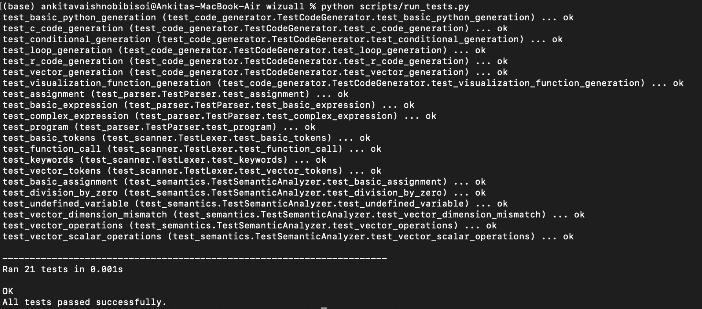
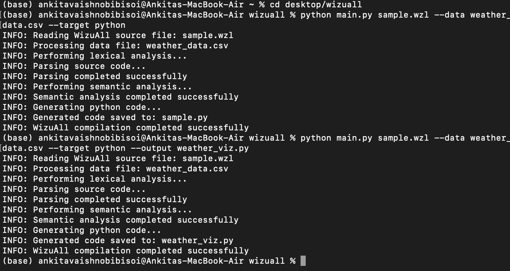

# WizuAll Compiler

A complete toolchain for the WizuAll programming language, designed for data visualization. This compiler translates WizuAll code into Python, C, or R for generating various types of visualizations.

## Developers
Ankita Vaishnobi Bisoi (2021B1A72306G)<br>
Tanishq Jain (2021B3A72941G)

## Project Structure

```
wizuall-compiler/
├── preprocessor/
│   ├── __init__.py
│   ├── pdf_extractor.py
│   └── data_formatter.py
├── scanner/
│   ├── __init__.py
│   └── lexer.py
├── parser/
│   ├── __init__.py
│   └── parser.py
├── semantics/
│   ├── __init__.py
│   ├── symbol_table.py
│   └── semantic_analyzer.py
├── visual_primitives/
│   ├── __init__.py
│   └── viz_functions.py
├── runtime/
│   ├── __init__.py
│   └── executor.py
├── tests/
│   ├── test_scanner.py
│   ├── test_parser.py
│   └── test_semantics.py
│   └── test_code_generator.py
├── scripts/
│   ├── build.py
│   └── run_tests.py
├── main.py
└── README.md
```

## The WizuAll Language

WizuAll is a language designed for data visualization with the following features:

1. **Vector Arithmetic**: Built on CalciList, WizuAll supports vector operations like addition, subtraction, multiplication, and division.
2. **Variable Assignment**: Global variables with lexical scope.
3. **Control Flow**: Conditional statements and while loops.
4. **External Function Calls**: Can call functions from the target language.
5. **Visualization Primitives**: Built-in functions for generating visualizations.

### Example WizuAll Program

```
# Define data vectors
x = [1, 2, 3, 4, 5]
y = [5, 7, 9, 11, 13]

# Calculate some statistics
sum_x = vec_average(x)
max_y = vec_max(y)

# Perform vector operations
z = x + y

# Create a basic line plot
plot(x, y)

# Output the final result
print(z)
```

## Compiler Features

1. **Preprocessing**: Extract numeric data from complex documents like PDFs.
2. **Lexical Analysis**: Tokenize WizuAll source code.
3. **Syntax Analysis**: Parse tokens into an Abstract Syntax Tree (AST).
4. **Semantic Analysis**: Perform type checking and validate operations.
5. **Code Generation**: Generate target language code (Python, C, or R).
6. **Execution**: Compile and execute the generated code.

## Visualization Primitives

WizuAll supports various visualization functions:

1. **Basic Plots**: `plot()`, `scatter()`, `bar()`, `line()`
2. **Data Distribution**: `histogram()`, `heatmap()`
3. **Vector Operations**: `vec_average()`, `vec_max()`, `vec_min()`, `vec_reverse()`
4. **Advanced Analytics**: `vec_product()`, `vec_compare()`, `clustering()`, `classification()`

## Getting Started

### Prerequisites

- Python 3.7+
- Required packages: numpy, matplotlib, PyPDF2, seaborn, scikit-learn

### Installation

1. Clone the repository:
   ```
   git clone https://github.com/KitVB/wizuall-compiler.git
   cd wizuall-compiler
   ```

2. Install dependencies:
   ```
   pip install numpy matplotlib PyPDF2 seaborn scikit-learn
   ```

3. Run the build script:
   ```
   python scripts/build.py --all
   ```

### Usage

To compile a WizuAll program:

```bash
python main.py path/to/your_program.wzl [options]
```

Options:
- `--data`: Path to data file (CSV, PDF, etc.)
- `--target`: Target language (python, c, r)
- `--output`: Output file path
- `--execute`: Execute the generated code
- `--verbose`: Enable verbose output

### Running Tests

To run a specific test module:

```bash
python scripts/run_tests.py --module parser
```

To run the test suite:

```bash
python scripts/run_tests.py
```



## Example Usage

The WizuAll compiler successfully processes source files and external data:

```bash
# Basic compilation with data file
python main.py sample.wzl --data weather_data.csv --target python

# Specifying custom output file
python main.py sample.wzl --data weather_data.csv --target python --output weather_viz.py

```



## Acknowledgments

This project was developed as part of the Compiler Construction (CS F363) course at BITS Pilani, K K Birla Goa Campus for the second semester in the academic year 2024-2025.

